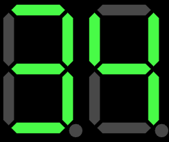
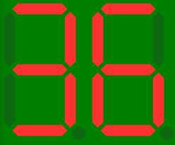
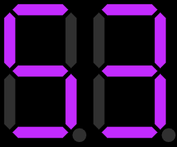

# Description:

Sample app presenting 8-bit display sim, created as React component

# Import Component:

```jsx
import Display from "./path/to/component";
```

# Usage:

```jsx
<Display value={value} width={width} theme="apollo"></Display>
```

**value** needs to be provided as number (can be float or integer)\
**width** provide width of single digit in pixels\
**theme** select one out ofg three color patterns: \

# apollo:



# classic:



# electronic:


